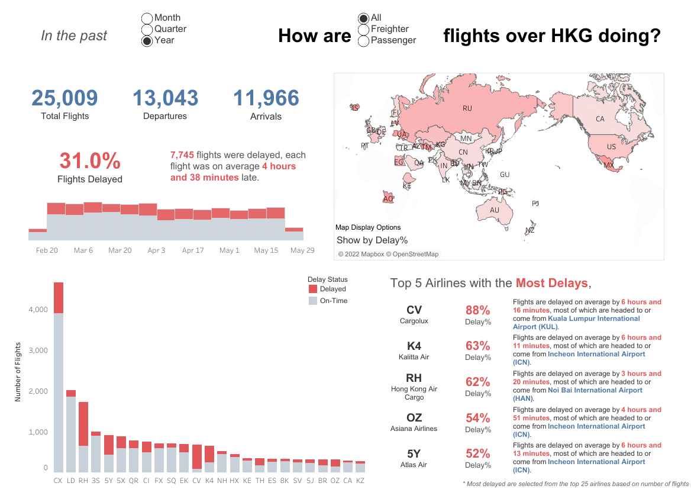

# Exploring Flight Performances in HKG

Understanding more about flights departing and arriving at HKG.

#### -- Project Start: May 1st, 2022
#### -- Expected Duration: 3-5 months
#### -- Project Status: [Active, ~~On-Hold~~, ~~Completed~~]
#### -- Expected Technologies: R, Python, ETL, GCP Bigquery, Tableau, XGBoost, AWS Sagemaker 


## Project Highlights

Tableau Dashboard: [Flights Through Hong Kong International Airport](https://public.tableau.com/app/profile/yoshi.man1207/viz/FlightsThroughHongKongInternationalAirport/Overview)



## Description
With flights being limited in Hong Kong during the COVID-19 pandemic, what was traditionally a major international flight hub has been challenged lately as more airlines warn [the risks of pulling HKG out](https://www.scmp.com/news/hong-kong/transport/article/3178600/hong-kong-bypassed-european-airlines-warn-they-cant-add) of their maps altogther. Having seen that there exists a [pulicly available API](https://data.gov.hk/en-data/dataset/aahk-team1-flight-info) provided by the Hong Kong Airport Authority, I decided to look into how flights are doing in HKG in the past few months, and gain a better overall understanding of the situation HKG is experiencing.

## Descriptive Analytics - Method
Exploratory Data Analysis will be useful in helping us gain a basic understanding of flights in HKG, which I see comprises of two main tasks - **Explore a static dataset with R, and create Data Visualisations with Tableau**. 

Before we do so, expecting this project duration to be in the scale of months, the hope is to bring in a lightweight data pipeline that:
1. Extracts the required data and transforms it into a useful format
2. Stores the data into a data warehouse at a regular interval
3. Run data visualisations on top of the data warehouse

That way, we are able to continuously collect data while working on different parts of the project.

#### -- Expected Duration: 1-2 months
#### -- Progress Status: [~~Active~~, ~~On-Hold~~, Completed]
#### -- Read More at ```/explore```

## Preditive Analytics - Method
Having collected continuously a dataset, the hope is to attempt building a predictive model using XGBoost to predict flight delays ahead of time. A great thing about having a data pipeline in place is that we can contiuously monitor the model performance and retrain if we detect a data drift. 

To get to that point, the steps involved will be to:
1. Build a training dataset based on brainstormed features
2. Fit training set to an XGBoost model; validate using cross-validation set
3. Evaluate model based on test set on decided metrics
4. Make batch predictions on upcoming departure flights in ```range(t+1, t+15)```
6. Rolling evaluation of model on decided metrics
5. Build a visualisation for model monitoring
7. Retrain model if data drifts
8. Automate this process on AWS Sagemaker*

*Depends on time and cost, the ultimate goal is to at least get one iteration of this pipeline to run automatically


#### -- Expected Duration: 2-3 months
#### -- Progress Status: [~~Active~~, On-Hold, ~~Completed~~]
#### -- Read More at ```/predict```


## Getting Started
If you would like to try out the code or notebooks, simply clone this repo and run it yourself. Currently completed tasks:
- ETL Jupyter notebook under the ```/explore/extract_transform_load.ipynb```.


